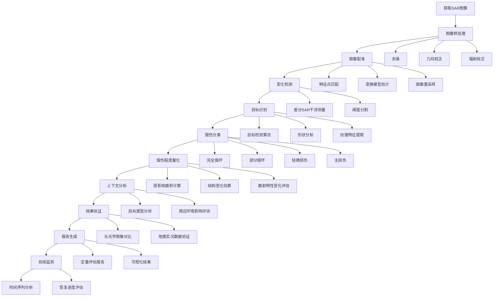

```mermaid
graph TD
    A[获取SAR图像] --> B[图像预处理]
    B --> C[图像配准]
    C --> D[变化检测]
    D --> E[目标识别]
    E --> F[毁伤分类]
    F --> G[毁伤程度量化]
    G --> H[上下文分析]
    H --> I[结果验证]
    I --> J[报告生成]
    J --> K[后续监测]

    B --> B1[去噪]
    B --> B2[几何校正]
    B --> B3[辐射校正]

    C --> C1[特征点匹配]
    C --> C2[变换模型估计]
    C --> C3[图像重采样]

    D --> D1[差分SAR干涉测量]
    D --> D2[阈值分割]

    E --> E1[目标检测算法]
    E --> E2[形状分析]
    E --> E3[纹理特征提取]

    F --> F1[完全毁坏]
    F --> F2[部分毁坏]
    F --> F3[轻微损伤]
    F --> F4[无损伤]

    G --> G1[受影响面积计算]
    G --> G2[结构变化估算]
    G --> G3[散射特性变化评估]

    H --> H1[目标类型分析]
    H --> H2[周边环境影响评估]

    I --> I1[与光学图像对比]
    I --> I2[地面实况数据验证]

    J --> J1[定量评估报告]
    J --> J2[可视化结果]

    K --> K1[时间序列分析]
    K --> K2[恢复进度评估]
```
