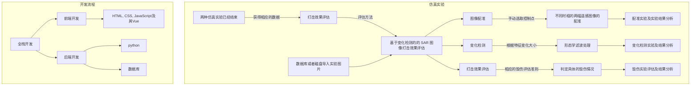

```mermaid
graph TD
  subgraph 仿真实验
  A[两种仿真实验已经结束]--> |获得相应的数据|B[打击效果的评估]
  B[打击效果评估]-->|评估方法|C[基于变化检测的的 SAR 图像打击效果评估]
  C-->D[图像配准]
  C-->E[变化检测]
  C-->F[打击效果评估]
  D-->|手动选取控制点|j[不同时相的两幅遥感图像的配准]
  E-->|根据特征变化大小|f[形态学滤波处理]
  F-->|相应的毁伤评估准则|g[判定具体的毁伤情况]
  j-->h1[配准实验及实验结果分析]
  f-->h2[变化检测实验及结果分析]
  g-->h3[毁伤实验评估及结果分析]
  N[数据库或者磁盘导入实验图片]-->C
  end

  subgraph 开发流程
  M[全栈开发]-->m1[前端开发]
  M-->m2[后端开发]
  m1[前端开发]-->m11[HTML, CSS, JavaScript及其Vue]
  m2-->m21[python]
  m2-->m22[数据库]
  end

```
