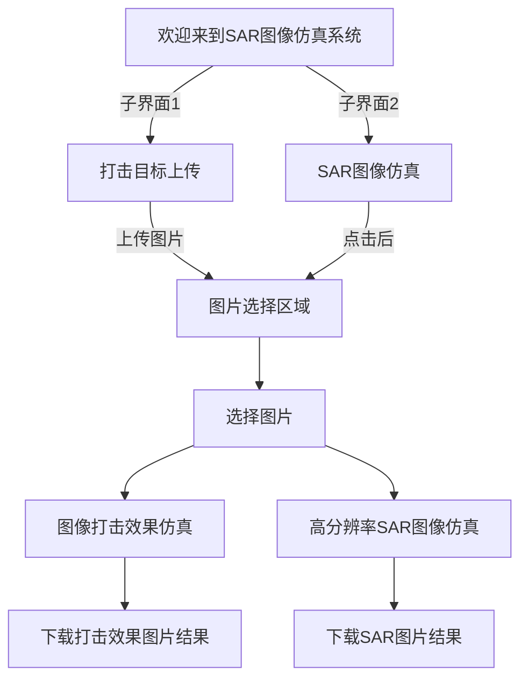

# 改善代码
## 要将新生成的代码与现有的simulate.py文件中的代码融合，以实现更自然的打击效果
## 我们需要在plot_difference函数中加入柏林噪声来模拟不规则的毁伤效果。以下是融合后的代码：

```python
import cv2
import streamlit as st
import draw  # import my module
import numpy as np
import matplotlib.pyplot as plt
import plotly.graph_objects as go
import os
from noise import pnoise2  # 导入柏林噪声函数

def plot_difference(original_picture, picture):
    # Compute the absolute difference
    difference = np.abs(original_picture.astype(int) - picture.astype(int))

    # Convert the difference to uint8
    difference = difference.astype(np.uint8)

    # Create the x, y, and z coordinate arrays
    y, x = np.mgrid[:difference.shape[0], :difference.shape[1]]
    z = difference

    # Apply Perlin noise to simulate more natural effects
    scale = 0.1  # Scale of the noise
    for i in range(z.shape[0]):
        for j in range(z.shape[1]):
            z[i, j] += pnoise2(i * scale, j * scale) * 255  # Adjust intensity of the effect

    # Create a 3D surface plot
    fig = go.Figure(data=[go.Surface(z=z, x=x, y=y)])

    return fig

def simulate():
  # Create sliders
  # (Your existing simulate function code goes here)


  #基于拓展要扩展locaterunway.py的功能，使其支持多个文件的上传和下载的两个想法
  #改善页面
  #用于选择上传多个图片中的一个来进行仿真，而不是在“图像打击效果仿真”页面里面直接上传图片
  #如何在STReamlit里面页面里面加入一个”打击目标“的功能区，该功能区需要具备能一次性容纳一百张规格＜500MB的图片，并通过点击该功能区中的照片中的任何一个位置后，可以自动给予两个选项“分别是”高分辨率SAR图像仿真“和”图像打击效果仿真“，
#要在Streamlit中实现这一功能，我们需要对main.py进行一些修改，以加入一个新的功能区用于上传和选择图片，并在点击图片后提供仿真选项。以下是详细的步骤和代码实现：
#使用st.file_uploader允许用户上传多个图片文件。
#使用st.image显示上传的图片，并使用st.button或st.selectbox来让用户选择进行的操作（高分辨率SAR图像仿真或图像打击效果仿真）。
#根据用户的选择调用simulate或sar函数。
#由于Streamlit不直接支持在图片上点击后弹出选项的功能，我们将采用一个简化的方法：让用户首先点击图片，然后通过下拉菜单选择要进行的操作。
#这段代码实现了一个简单的界面，用户可以在其中上传图片，并选择进行高分辨率SAR图像仿真或图像打击效果仿真。请注意，这里的实现假设simulate和sar函数可以独立于用户上传的图片运行。如果这些函数需要特定的图片输入，你可能需要进一步修改代码以将选定的图片传递给这些函数。

from simulate import simulate
from SAR import sar
import streamlit as st

def main():
    # 创建侧边栏选择框
    page = st.sidebar.selectbox("选择你的界面", [
        "主界面",
        "图像打击效果仿真",
        "高分辨率SAR图像仿真",
        "打击目标"
    ])

    if page == "主界面":
        # 主界面内容
        st.title("欢迎来到SAR图像仿真系统")
        # TODO: 在这里写主界面的内容,应该是项目简介,使用说明等等
        st.write("请在侧边栏选择您想要查看的页面")

    elif page == "图像打击效果仿真":
        # 第一个子页面内容
        st.title("图像打击效果仿真")
        simulate()

    elif page == "高分辨率SAR图像仿真":
        # 第二个子页面内容
        st.title("高分辨率SAR图像仿真")
        sar()

    elif page == "打击目标":
        # 新增的打击目标功能区
        st.title("打击目标")
        uploaded_files = st.file_uploader("上传图片", accept_multiple_files=True, type=['jpg', 'jpeg', 'png'], help="一次性上传多张图片")

        if uploaded_files:
            for uploaded_file in uploaded_files:
                st.image(uploaded_file, caption=uploaded_file.name, width=100)

            selected_action = st.selectbox("选择操作", ["请选择操作", "高分辨率SAR图像仿真", "图像打击效果仿真"])

            if selected_action == "高分辨率SAR图像仿真":
                sar()
            elif selected_action == "图像打击效果仿真":
                simulate()

if __name__ == "__main__":
    main()


  #要扩展locaterunway.py的功能，使其支持多个文件的上传和下载，并且允许用户点击功能区内的图片进行仿真：
  #使用Streamlit的st.file_uploader方法允许多文件上传。
  #存储上传的图片，并为每张图片创建一个可点击的缩略图。
  #当用户点击某个图片时，执行相应的仿真过程。
  #目标文件是locaterunway.py
import streamlit as st
import numpy as np
from PIL import Image
import plotly.graph_objs as go
import cv2
from scipy.fftpack import fft2, ifft2, fftshift, ifftshift
import matplotlib.pyplot as plt

# 改进1: 允许用户上传多个文件
uploaded_files = st.file_uploader("Choose images", accept_multiple_files=True, type=['jpg', 'jpeg', 'png'])

# 用于存储上传的图片及其处理后的版本
images = []
processed_images = []

for uploaded_file in uploaded_files:
    # 读取图片
    img = Image.open(uploaded_file)
    img_array = np.array(img)

    # 转换为灰度图像
    gray_img = cv2.cvtColor(img_array, cv2.COLOR_RGB2GRAY)
    images.append(gray_img)

# 改进2: 为每张图片创建一个可点击的缩略图
for i, img in enumerate(images):
    st.image(img, caption=f"Image {i+1}", width=100, use_column_width=False)

# 用户输入部分保持不变

# 改进3: 当用户点击某个图片时，执行相应的仿真过程
# 这里需要一个机制来确定用户点击了哪张图片，但Streamlit当前不直接支持点击图片来触发事件。
# 作为替代，您可以要求用户输入他们想要处理的图片编号。

image_index = st.number_input('Enter the number of the image you want to process:', min_value=1, max_value=len(images), step=1) - 1

if st.button('Process Image'):
    # 假设用户已经选择了一个有效的图片编号
    selected_img = images[image_index]

    # 在这里执行对selected_img的处理
    # 例如，可以调用region_growing或其他任何处理函数

    # 处理后的图片可以添加到processed_images列表中
    # processed_images.append(processed_img)

    # 显示处理后的图片
    # st.image(processed_img, caption=f"Processed Image {image_index+1}")
```

## 程序框架图
- 先定义框图
- 然后连线
