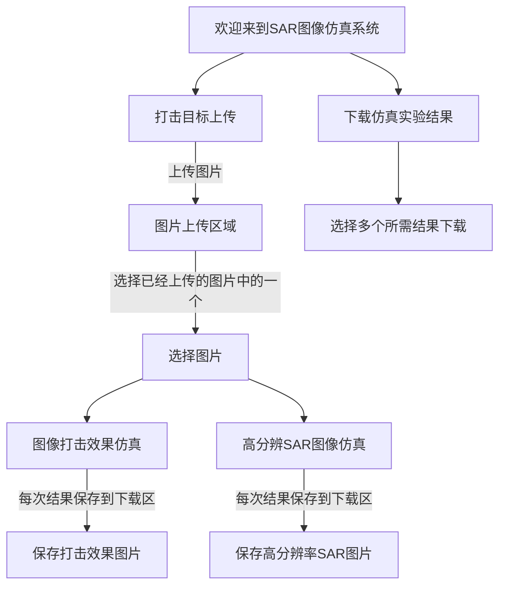

```mermaid
graph TD
  A[欢迎来到SAR图像仿真系统]
  B[打击目标上传] 
  C[图片上传区域]
  E[选择图片]
  F[图像打击效果仿真]
  G[高分辨SAR图像仿真]
  J[下载仿真实验结果]
  J1[选择多个所需结果下载]
  H1[保存打击效果图片]
  H2[保存高分辨率SAR图片]
  A --> B
  B --> |上传图片|C
  C --> |选择已经上传的图片中的一个|E
  E --> F
  E --> G
  F --> |每次结果保存到下载区|H1
  G --> |每次结果保存到下载区|H2
  A-->J
  J-->J1


```
