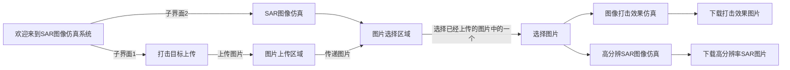

```mermaid
graph LR
  A[欢迎来到SAR图像仿真系统]
  B[打击目标上传] 
  C[SAR图像仿真]
  D[图片上传区域]
  E[图片选择区域]
  E2[选择图片]
  F[图像打击效果仿真]
  G[高分辨SAR图像仿真]
  H1[下载打击效果图片]
  H2[下载高分辨率SAR图片]
  A --> |子界面1|B
  A --> |子界面2|C
  B --> |上传图片|D
  C --> E
  E --> |选择已经上传的图片中的一个|E2
  D --> |传递图片|E
  E2 --> F
  E2 --> G
  F --> H1
  G --> H2


```
